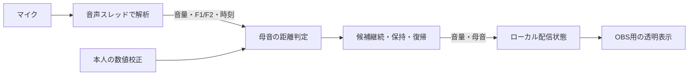

# マイク母音判別の仕様

## 対象

Issue #2で合意した、日本語の5母音に応じた配信用口形。生成AI・学習済みモデル・音声文字起こし・外部への音声送信は使わない。同一のPCM入力、校正値、設定、フレーム時刻から同じ判定を返す。処理途中のPCMは音声スレッド内の固定長バッファだけに保持する。

## 解析

`src/stream/audio-worklet.ts`がモノラルPCMを30ms窓、10msホップで処理する。音声は出力へ流さず、出力バッファはゼロ。`formants.ts`がDC除去後のRMS、正規化自己相関による周期性、F1/F2を求める。音声スレッドから主スレッドへ渡すのはこの数値と音声時刻だけ。

解析上限は4500/5000/5500/6000/6500Hz（初期5500Hz）。48タップの窓付きsinc FIRで上限の2倍のサンプルレートへ変換し、50Hzからのプリエンファシス、Hamming窓、10次Burg LPCを適用する。LPC包絡を10Hz間隔で走査する。

周期性0.65未満、RMS 0.0001未満、不正な入力、不安定なLPC、極端な予測残差は棄却する。包絡ピークは帯域30〜600Hzを候補とし、3ピーク以上を要求する。F1は150〜1300Hz、F2は500〜3500Hz、F2/F1は1.2超。条件を満たさない場合は特徴なしとし、母音を強制分類しない。これらは初期の実装条件であり、実声に対する万能な判別規則ではない。

## 校正と保存

本人が各母音を2秒×2回発声する。測定区間の最初300ms・最後200msは除外する。無音しきい値を超え、隣接フレーム間隔25ms以内、F1/F2の対数変化が各0.12以内の特徴を使用する。各回50フレーム以上が必要。

各軸の対数値の中央値を中心とし、ばらつきは `max(0.06, 1.4826 × MAD)`。ばらつきが0.18を超える、2回の中心の距離が0.2を超える、母音間の中心の距離が0.15未満の場合は校正を拒否する。途中の不足は同じ測定を再試行でき、全体の不一致は校正し直す。

保存するのはversion=1、入力デバイスID、解析上限、5母音の中心とばらつきのみ。localStorageへデバイスと解析上限ごとに保存する。保存値はバージョン・入力デバイス・解析上限・有限値・範囲・母音間の距離を検証し、既知フィールドのみ読み込む。不正値は未校正として扱う。保存失敗でもメモリー上の校正は使用できる。マイク開始時に実際の入力デバイスIDで再確認し、条件の異なるプロファイルを流用しない。

## 分類と時間制御

対数F1/F2の差を校正時のばらつきで除した2次元ユークリッド距離を求める。最小距離4以内、かつ第2候補との差1.5以上なら最小の母音を採用し、それ以外は判別不能。ランダムな口形を混ぜない。

新候補は30ms継続で確定する。確定した口形は最後に一致する候補が得られてから120msまで保持し、それ以降は母音null（従来の音量口パク）へ戻す。無音は直ちに判定状態をリセットする。音声フレームに250ms超の空白や時刻逆転があれば履歴をリセットする。主スレッドで750ms以上解析結果が途絶えた場合はマイクを停止する。

## 配信連携

ローカル状態に `vowel: a|i|u|e|o|null` を追加する。省略した従来のPOSTはnullとして受け入れ、不正な母音は400。音量0と1.5秒の失効では母音もnullにする。送信・取得は各約33ms間隔、描画は最大30FPS。要求を直列に送り重複させない。

母音が確定している場合は、既存の基準開き（a=.9/i=.5/u=.4/e=.62/o=.75）×平滑化した音量で開閉し、既存のmouthForm（a=0/i=-.85/u=.9/e=-.4/o=.6）を使う。母音nullは従来と同じ開閉。判定の時間制御と描画エンジンの口形境界ヒステリシスを併用する。

描画の音量平滑化は開く時40ms・閉じる時80msの時定数を使う。無音や接続失効で母音nullになっても、閉じる途中は直前の口形を維持し、口が閉じてから形をリセットする。「う」の小さい口が閉じ際に「あ」へ拡大することを防ぐ。

マイク停止・切断・処理異常・画面終了ではトラック・ノード・AudioContextを解放する。許可待ちの取消後に届いたトラックも停止する。OBSへの音声入力は従来どおり別途設定する。

## 検証と制限

自動検証は独立した共鳴器で生成した合成有声音、無音、DC、雑音、単純な正弦波、校正拒否、保存値検証、候補継続・保持・復帰、ローカル状態の検証、およびブラウザーの実際の音声経路を使用する。合成信号の合格を実声の精度保証にしない。

本人の持続母音・普通の会話・子音・ささやき・高い声・笑い声・雑音での誤分類と判別不能率、OBSを含む総遅延は未確認。受け入れ値は本人の実測結果から決める。現在の既定値は初期試用向けであり、全話者・全マイクでの精度を保証しない。

校正と使用では同じマイク処理条件を要求する（エコー除去・ノイズ抑制オン、自動音量調整オフ）。ブラウザーが実際に適用する処理やボイスチェンジャーの影響は別途確認する。使い方と手動評価手順は[配信手順](streaming.ja.md)を参照。

根拠：[Praatのフォルマント解析仕様](https://www.fon.hum.uva.nl/praat/manual/Sound__To_Formant__burg____.html)、[Web Audio仕様](https://github.com/webaudio/web-audio-api/blob/main/index.bs)。Praatの実装を完全再現するものではない。
